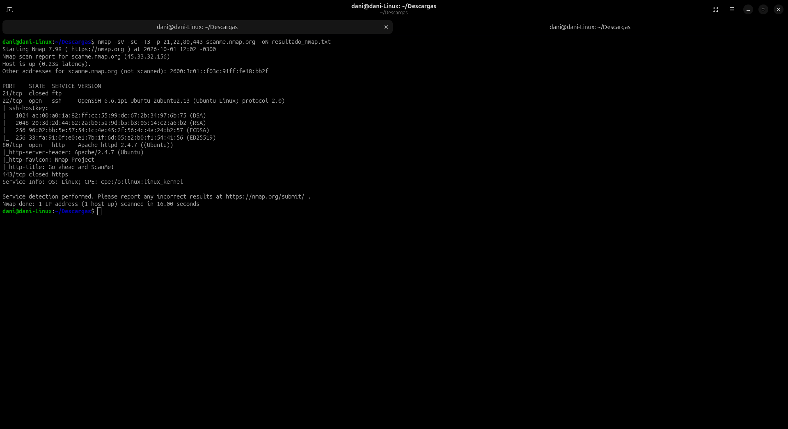

# Objetivo 2: Escaneo de Red (Nmap)
### nmap -sV -sC -T3 -p 21,22,80,443 scanme.nmap.org -oN resultado_nmap.txt

    # Nmap 7.98 scan initiated Thu Oct  1 12:02:03 2026 as: nmap -sV -sC -T3 -p 21,22,80,443 -oN resultado_nmap.txt scanme.nmap.org
    Nmap scan report for scanme.nmap.org (45.33.32.156)
    Host is up (0.23s latency).
    Other addresses for scanme.nmap.org (not scanned): 2600:3c01::f03c:91ff:fe18:bb2f

    PORT    STATE  SERVICE VERSION
    21/tcp  closed ftp
    22/tcp  open   ssh     OpenSSH 6.6.1p1 Ubuntu 2ubuntu2.13 (Ubuntu Linux; protocol 2.0)
    | ssh-hostkey: 
    |   1024 ac:00:a0:1a:82:ff:cc:55:99:dc:67:2b:34:97:6b:75 (DSA)
    |   2048 20:3d:2d:44:62:2a:b0:5a:9d:b5:b3:05:14:c2:a6:b2 (RSA)
    |   256 96:02:bb:5e:57:54:1c:4e:45:2f:56:4c:4a:24:b2:57 (ECDSA)
    |_  256 33:fa:91:0f:e0:e1:7b:1f:6d:05:a2:b0:f1:54:41:56 (ED25519)
    80/tcp  open   http    Apache httpd 2.4.7 ((Ubuntu))
    |_http-server-header: Apache/2.4.7 (Ubuntu)
    |_http-favicon: Nmap Project
    |_http-title: Go ahead and ScanMe!
    443/tcp closed https
    Service Info: OS: Linux; CPE: cpe:/o:linux:linux_kernel

    Service detection performed. Please report any incorrect results at https://nmap.org/submit/ .
    # Nmap done at Thu Oct  1 12:02:19 2026 -- 1 IP address (1 host up) scanned in 16.00 seconds