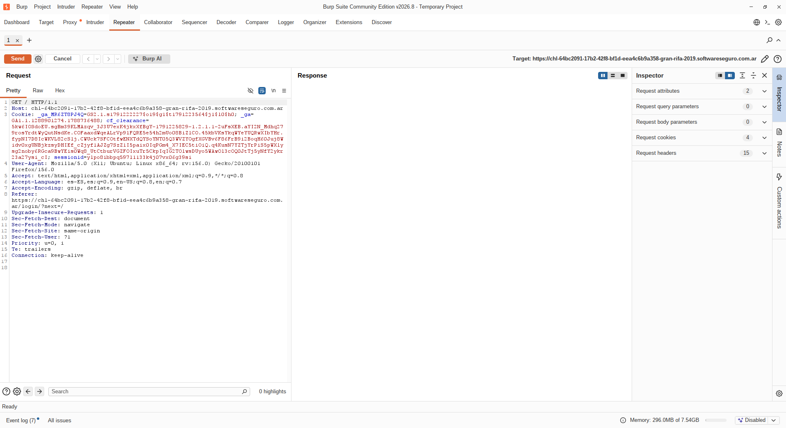
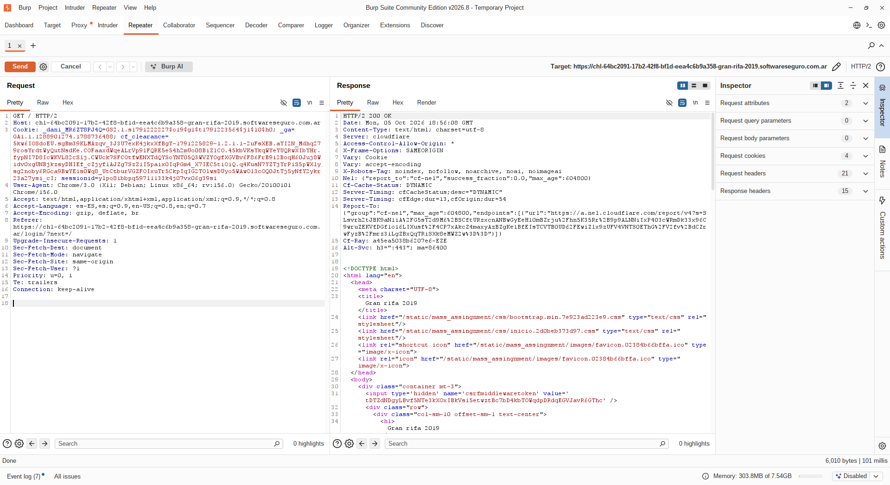

# Objetivo 2: Manipulación Manual de Peticiones (Uso del Repeater)

    Se modifico el valor de la Cookie: _dani_MR6ZT8PJ4Q
    y el User-Agent: hrome/3.0 (X11; Debian; Linux x86_64; rv:156.0) Gecko/20100101 Chrome/156.0
