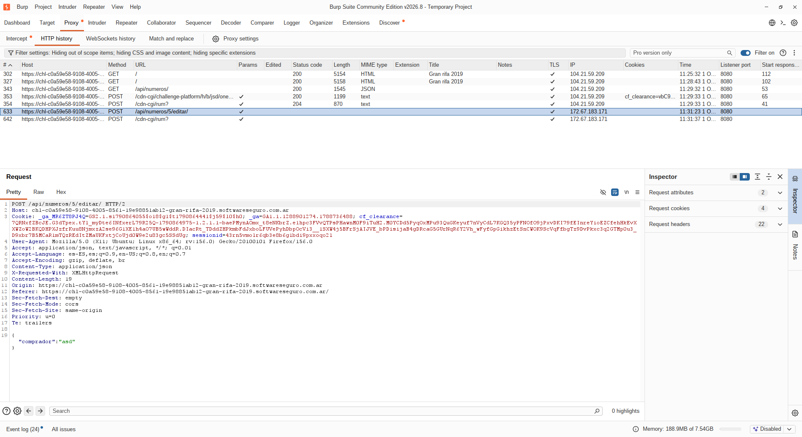

# Objetivo 4 Instalacion de proxy

## Proxy

    Un servidor proxy es un intermediario que reenvía el tráfico de aplicaciones específicas (por ejemplo, tu navegador web o un cliente de torrents).

    Cómo funciona: Cuando haces una petición web a través de un proxy, la solicitud va primero al servidor proxy, este reemplaza tu dirección IP por la suya y envía la petición al sitio de destino.

    Nivel de red: Opera principalmente en la capa de aplicación (HTTP, HTTPS, SOCKS).

    Cifrado: No cifra el tráfico por defecto (a menos que uses un proxy HTTPS), por lo que tu proveedor de Internet (ISP) o un atacante en la red local aún pueden ver los datos que transmites.

## Diferencias entre proxy y VPN

    1. El proxy trabaja solo la aplicación configurada (ej. el navegador). El VPN en cambio trabaja en todo el dispositivo y sistema operativo.

    2. El proxy no cifra los datos o limitado a HTTPS. La VNP Cifra los datos completamente de extremo a extremo.

    3. La privacidad es baja porque el ISP puede ver que páginas se visitan. En la VPN el ISP solo ve un túnel de tráfico cifrado.

    4. El proxy es mas rápido que la VPN.

    5. El proxy sirve para saltarse bloqueos geográficos simples o cachés de red. La VPN sirve para proteger la privacidad en Wi-Fi públicas y seguridad integral y evitar que tu proveedor de Internet rastree tu navegación en general.